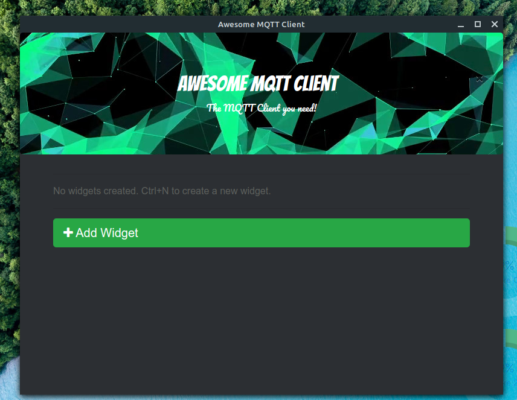

# Awesome-MQTT-Client
---
_Awesome-MQTT-Client_ is an MQTT client which aims to be beginner friendly for people learning IoT.
It is modern looking and works on top of your browser. _Awesome-MQTT-Client_ uses **paho-mqtt** library in python.
It is developed with the eel micro framework in Python 3. It uses sqlite3 store settings and widgets locally on the machine.
It is being developed. Thus, you can only add fancy widgets but soon it will have some good functionality with speech recognition widgets,
desktop notifier widgets, etc.

**Note:**The project is in development, therefore you cannot do much with it as of now. But I am trying to make it usable.

## Installation
---
It is recommended that you use a virtual environment with Python 3 already installed for the setup.
To install the project, just clone the content onto your machine.
In the project directory, open up a terminal window, now run `python3 setup.py` or `python setup.py`.
After that, it will install some dependencies based on either you have Linux or Windows.

#### Screenshots
---

